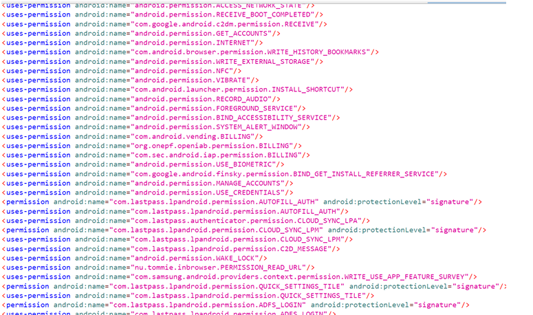
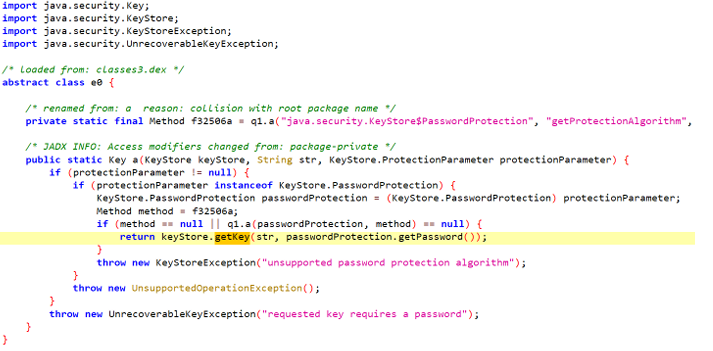
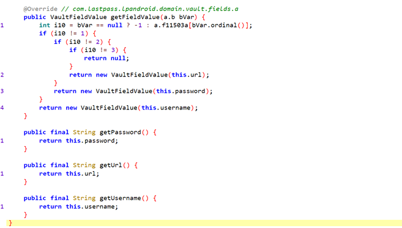
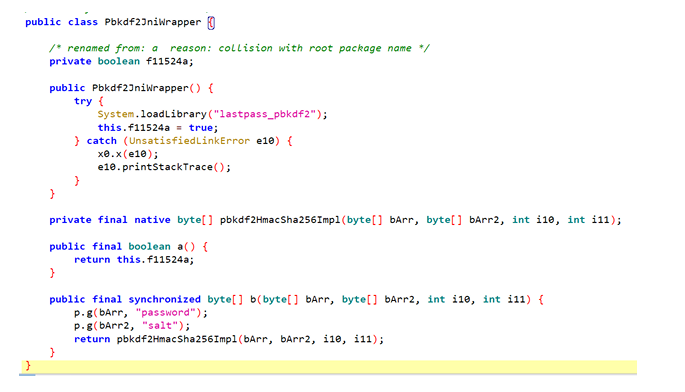
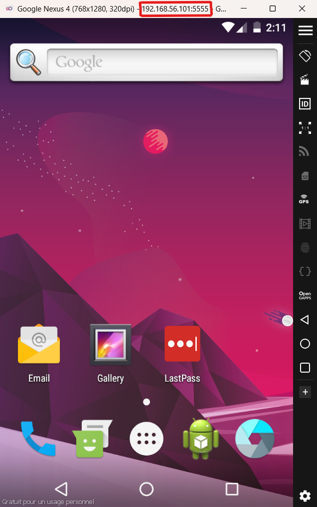
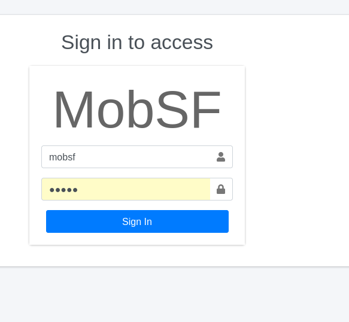
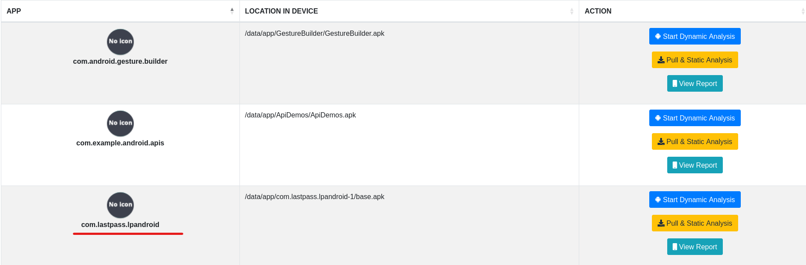
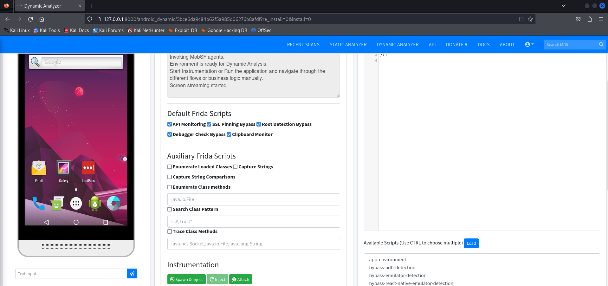
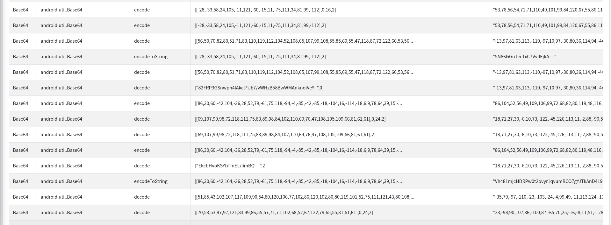
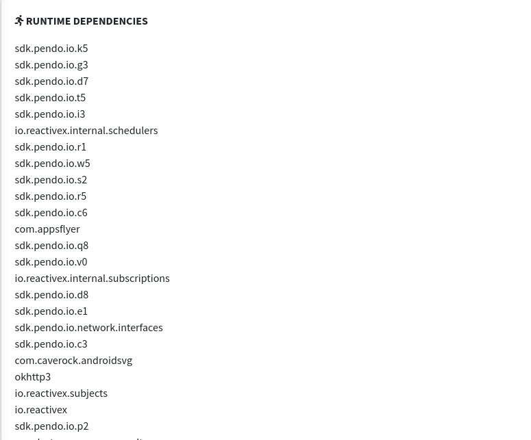

# Analyse des gestionnaire des mot de passe
## Introduction
Les gestionnaires de mots de passe sont des outils essentiels pour sécuriser les informations sensibles des utilisateurs, en particulier dans un contexte où la sécurité des données personnelles est une priorité croissante. Des applications comme LastPass, 1Password, NordPass, et Keeper permettent de stocker et de gérer des identifiants et mots de passe de manière centralisée et sécurisée. Cependant, malgré leur popularité, ces applications sont également des cibles potentielles pour les cyberattaques, en raison de la sensibilité des informations qu’elles protègent.

Ce projet vise à analyser les aspects de sécurité des gestionnaires de mots de passe mobiles en utilisant des méthodes statiques et dynamiques. L'analyse statique consiste à examiner le code source de l’application (lorsqu'il est disponible) ou ses fichiers compilés, à identifier les vulnérabilités potentielles et à évaluer les pratiques de développement. En parallèle, l’analyse dynamique permet d’observer le comportement de l’application en temps réel, lors de son exécution, pour détecter d’éventuels écarts par rapport aux principes de sécurité tels que la protection des données, l’accès réseau et la gestion des identifiants.

## LastPass
### 1.Analyse Statique
1. Décompression et décompilation du fichier APK :

La première étape de l'analyse statique consiste à accéder au contenu interne de l'application mobile en décompressant et en décompilant le fichier APK (Android Package Kit). Un fichier APK est le format de fichier utilisé pour distribuer et installer des applications sur le système d'exploitation Android. Pour mener à bien cette étape, nous utilisons des outils spécialisés tels qu'APKTool et JADX.

- [APKTOOL](https://apktool.org/docs/install) est un outil puissant qui permet de décompiler et de recompiler des fichiers APK. Il permet d’extraire les ressources de l'application (fichiers XML, images, etc.) ainsi que les fichiers de configuration, comme le fichier AndroidManifest.xml. Ce dernier contient des informations cruciales concernant les autorisations demandées par l'application, les composants utilisés (activités, services, récepteurs de diffusion), et d'autres configurations importantes qui peuvent donner des indices sur le comportement de l'application. 

    

- JADX est un décompilateur qui permet de convertir le bytecode DEX (Dalvik Executable) contenu dans le fichier APK en code Java lisible. Cela permet d'analyser le code source de l'application pour identifier les méthodes implémentées et les potentielles vulnérabilités présentes dans le code. Par exemple, nous pouvons rechercher des erreurs de programmation, des failles liées à la gestion des identifiants, ou des pratiques de sécurité inadéquates comme l'utilisation de protocoles de cryptage faibles.

    

L'utilisation combinée d'APKTool et de JADX permet d'obtenir à la fois les ressources et le code source de l'application, ce qui constitue une base solide pour l'analyse statique. Cela nous aide à comprendre comment l'application est construite et à détecter des problèmes potentiels avant même de l'exécuter pour l'analyse dynamique.

les permissions de ***LastPass*** sont :

2. Analyse de code : Étude des fonctions critiques

L'analyse statique approfondie du code source extrait lors de la décompilation permet de se concentrer sur des fonctions spécifiques qui sont responsables de la sécurité des données sensibles, telles que les identifiants et mots de passe des utilisateurs. Dans cette étape, nous analysons des composants comme Keystore, Vault, et KDF.js, qui sont souvent utilisés dans les applications de gestion de mots de passe pour renforcer la sécurité.

-  Keystore :

- Vault :

- Key Derivation Function :

### 2.Analyse Dynamique

Pour l'étape d'analyse dynamique, nous allons utiliser Mobile Security Framework [MobSF](https://github.com/MobSF/Mobile-Security-Framework-MobSF), un outil open-source spécialisé dans l'analyse de sécurité des applications mobiles, notamment pour les fichiers APK Android et IPA iOS.

#### L'utilistaion de Mobsf : 
- Téléchargement :

        docker pull opensecurity/mobile-security-framework-mobsf:latest

- Exécutez MobSF avec prise en charge de l'analyse statique et dynamique :

        docker run -it --rm \
        -p 8000:8000 \
        -p 1337:1337 \
        -e MOBSF_ANALYZER_IDENTIFIER=<adb device identifier> \
        opensecurity/mobile-security-framework-mobsf:latest

N'oubliez pas de changer 
            
        <adb device identifier>
Par l'adresse que vous avez sur l'emulator,par exemple dans mon cas :

Tu vas trouver un login essayer d'utiliser ***mobsf / mobsf*** :

On va choisi notre apk :

On a maintenant cette interface : 

- les ***API MONITOR*** :

- Test TLS/SSL :

- Dependecies :

- Domains :

- DataBases :

